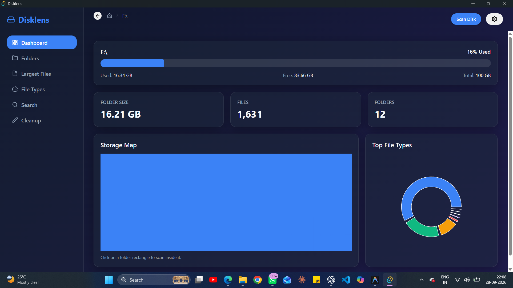

# Scandisk 🔍

> **A fast, beautiful, and private local disk usage analyzer for Windows, macOS, and Linux.**  
> Effortlessly visualize what is taking up space on your hard drive and clean it up safely.

[](LICENSE)
[]()
[]()

---

## 📸 Scandisk in Action on Windows



---

## 💡 What is Scandisk?

Have you ever wondered **"Why is my hard drive full?"** or spent hours digging through nested folders trying to find massive files?

**Scandisk** is a modern desktop utility designed to solve that problem instantly:
- **Instant Visual Breakdown**: See exactly which folders and file types consume the most gigabytes using an interactive, color-coded storage map (Treemap) and charts.
- **Lightning Fast**: Powered by a native multithreaded Rust engine, Scandisk scans hundreds of thousands of files across your drive in seconds without freezing your computer.
- **100% Private**: All scanning and calculations happen locally in memory on your PC. **No files, filenames, or disk telemetry are ever uploaded anywhere.**
- **Safe Cleanup**: Discover space-hogging files and move them to your system **Recycle Bin / Trash** with one click. Never deletes files permanently without confirmation.

---

## 🌟 Key Features

### 📊 1. Comprehensive Dashboard
- **Disk Overview**: View total capacity, used space, free space, and usage percentage for any drive (e.g., `C:\`, `F:\`) or folder.
- **Live Metrics**: Real-time counter of total folder size, file count, and folder count.

### 🗺️ 2. Interactive Storage Treemap
- Represents files and directories as proportional rectangles—the bigger the box, the more disk space it consumes.
- **Drill-Down Navigation**: Click on any folder rectangle to instantly dive inside that directory and recalculate the space distribution.
- **Breadcrumbs**: Seamlessly navigate back up through the folder hierarchy.

### 🍩 3. File Types Breakdown & Clickable Charts
- Interactive donut chart categorizing storage across extensions (Videos, Documents, Archives, Disk Images, etc.).
- **Click to Filter**: Click any slice in the chart to immediately view all files belonging to that category.

### 📁 4. Folders Explorer
- Displays immediate subdirectories with item counts and disk size.
- Direct quick-actions to **Scan Folder** (re-scan into that folder) or **Open in OS** (opens native Windows File Explorer).

### 📄 5. Largest Files Finder
- Identifies the top largest individual files across your scanned drive.
- Easily sort, reveal their path in File Explorer, or safely send them to the Recycle Bin.

### 🔍 6. Global File Search
- Instantly crawl thousands of files in your selected directory to find files matching any keyword or extension.

### 🧹 7. Smart Cleanup Experience
- Automatically highlights large temporary files, logs, and caches (`.tmp`, `.log`, `.bak`, `.iso`, `.dmg`).
- Safe deletion via your operating system's Recycle Bin / Trash mechanism.

### 🎨 8. Customizable Themes & Dark Mode
- Supports 3 tailored visual aesthetics:
  - **Material Design**: Clean cards with familiar, clear controls.
  - **Glassmorphism**: Translucent frosted glass with blur and sleek borders.
  - **Neumorphism**: Soft sculpted light and dark surfaces.
- Full support for **Light** and **Dark** modes with persistent local saving.

---

## 📥 Download & Install (For Users)

> **Zero setup required.** No command line, Node.js, or Rust needed. Simply download the installer for your computer:

👉 **[Download the Latest Release](https://github.com/shakeer7/scandisk/releases/latest)**

### 🪟 Windows
1. Download **`Scandisk_0.2.0_x64-setup.exe`**.
2. Double-click the installer and complete the setup.
3. Open **Scandisk** from your Start Menu or Desktop shortcut.

> [!IMPORTANT]
> **Windows Security Notice**  
> Since Scandisk isn't signed with a Microsoft certificate, Windows SmartScreen may show a "Windows protected your PC" warning.
> 
> To run Scandisk, follow these steps:
> 1. Click "More info" on the SmartScreen popup
> 2. Click "Run anyway" to start the installer

### 🍎 macOS
1. Download **`Scandisk_0.2.0_aarch64.dmg`** (for Apple Silicon M1/M2/M3/M4) or Intel version.
2. Open the downloaded `.dmg` and drag the **Scandisk** icon into your **Applications** folder.
3. Launch Scandisk from Launchpad or Spotlight.

> [!IMPORTANT]
> **macOS Security Notice**  
> Since Scandisk isn't signed with an Apple Developer certificate, macOS may show a "damaged and can't be opened" warning.
> 
> To fix this, open Terminal and run:
> ```bash
> sudo xattr -dr com.apple.quarantine /Applications/Scandisk.app
> ```

### 🐧 Linux
1. Download **`Scandisk_0.2.0_amd64.AppImage`** or **`.deb`**.
2. For AppImage: Make executable (`chmod +x Scandisk*.AppImage`) and double-click to run.

---

## 📖 How to Use Scandisk

1. **Select a Disk or Folder**: Click the **"Scan Disk"** or **"Select Folder"** button in the header and choose any drive (e.g. `C:\`, external drive) or directory.
2. **Watch the Scan**: The live counter shows files and folders as they are processed in real time.
3. **Explore Visually**: Click any folder tile on the Treemap to drill in, or switch tabs on the left sidebar to inspect **Folders**, **Largest Files**, and **File Types**.
4. **Free Up Space**: Head to the **Cleanup** tab to safely clean up unnecessary large files into the Recycle Bin.

---

## 🛡️ Privacy Guarantee

> **Your data stays on your device.**  
> Scandisk does not collect analytics, track usage, or upload any file paths, names, or disk information to any remote server or cloud service.

---

## 📄 License

This project is licensed under the [MIT License](LICENSE).
